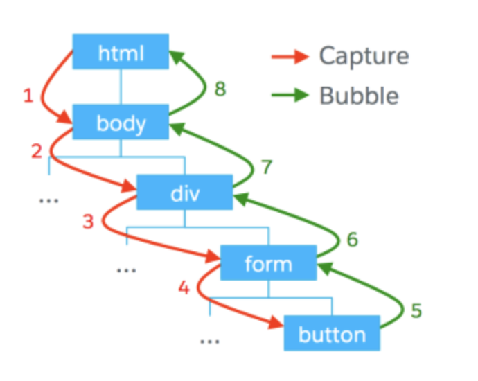

# 프론트엔드 면접 예상 질문

## 1. Javascript 의 데이터 타입과 Typescript 데이터 타입에 대해 설명해주세요.

자바스크립트는 동적 타이핑을 지원하는 언어로, 변수에 저장되는 값의 타입이 런타임에 결정됩니다. 이로인해 유연하게 코드르 작성할 수 있지만 숫자와 문자열을 의도치 않게 함께 사용 하는 등 예기치 않은 타입 오류가 발생할 수 있습니다.

반면에 타입스크립트는 기존의 자바스크립트에 정적 타입 시스템을 추가한 언어입니다. 코드 작성 시점에 타입을 명시하거나, 타입스크립트의 타입 추론을 통해 자동으로 타입이 결정됩니다.

타입스크립트를 사용하는 이유로는

1. 타입 안정성: 명시적 타입 선언을 통해 코드에서 의도찮은 타입 사용을 방지하여, 코드의 안정성과 가독성을 높입니다.
2. 개발자 도구 지원: VSCode와 같은 에디터에서 자동 완성, 코드 검사, 리팩토링 시 도움을 받을 수 있어 생산성을 높입니다.
3. 런타임 오류 감소: 타입 검사를 통해 컴파일 단계에서 오류를 발견할 수 있어, 런타입에서 발생 할 수 있는 오류를 사전에 줄입니다.

프론트엔드 개발 시, 타입스크립트는 컴포넌트의 props, 상태(state), API 응답 타입 등을 명확하게 정의 할 수 있어 대규모 프로젝트에서 유지보수성과 협업 효율을 크게 향상 시킵니다.
타입스크립트의 인터페이스와 제네릭을 사용하여 복잡한 데이터 구조를 명확히 모델링할 수 있고, 리팩토링 시 발생할 수 있는 타입 오류를 쉽게 발견하고 수정할 수 있습니다.

## 2. Javascript 의 객체지향에 대해 설명해주세요.

Javascript는 객체지향 프로그래밍(OOP) 패러다임을 지원하는 언어로, 코드 재사용성과 구조화된 설계를 통해 복잡한 애플리케이션을 효율적으로 작성할 수 있습니다. 객체지향의 핵심은 데이터를 중심으로 메서드와 속성을 묶어 객체라는 단위로 관리하는 것입니다.

### JavaScript의 객체지향 특징:

1. 객체 기반 설계: JavaScript는 객체(object)를 기반으로 하는 언어입니다. 모든 것이 객체로 이루어져 있으며, 객체는 프로퍼티와 메서드를 포함할 수 있습니다. 이는 데이터를 캡슐화하고 코드를 모듈화하여 유지보수를 쉽게 합니다.

2. 프로토타입 기반 상속: JavaScript는 클래스 기반 상속 대신 프로토타입을 사용하여 객체 간 상속을 구현합니다. 객체는 다른 객체의 프로토타입을 상속 받아 새로운 객체를 생성할 수 있으며, 이를 통해 재사용성과 확장성을 극대화할 수 있습니다.

```jsx
// 프로토타입 상속 예시
function Animal(name) {
  this.name = name;
}

Animal.prototype.speak = function () {
  console.log(`${this.name} make a sound`);
};

const dog = new Animal("Dog");
dog.speak(); // Dog makes a sound
```

3. 클래스와 생성자: ES6 이후, JavaScript는 `class` 문법을 도입하여 객체지향 프로그래밍을 좀 더 직관적으로 사용할 수 있도록 개선했습니다. 이 클래스는 프로토타입을 기반으로 동작하지만, 더욱 친숙하고 명확한 문법으로 객체와 상속을 정의할 수 있게 합니다.

```jsx
// 클래스 문법 사용 예시
class Animal {
  constructor(name) {
    this.name = name;
  }

  speak() {
    console.log(`${this.name} makes a sound`);
  }
}

const cat = new Animal("Cat");
Cat.speak(); // Cat makes a sound
```

4. 캡슐화, 상속, 다형성:

   - 캡술화: 객체의 상태를 보호하고 외부에서 직접 접근할 수 없도록 합니다
   - 상속: 기존 객체를 확장하여 새로운 객체를 만들 수 있습니다.
   - 다형성: 동일한 메서드가 다른 객체에서 다른 방식으로 동작하게 할 수 있습니다. 예를 들어, 상위 클래스의 메서드를 하위 클래스에서 재정의하여 사용할 수 있습니다.

5. 모듈성과 재사용성: 프론트엔드 개발에서 객체지향 프로그래밍은 UI 컴포넌트의 구조화와 재사용성을 높이는 데 유리합니다. React, Vue 같은 프레임워크에서도 객체지향 개념을 적용해 컴포넌트를 설계하고, 이를 통해 유지보수성과 코드 품질을 높입니다.

JavaScript의 객체지향 프로그래밍은 프론트엔드 개발에서 코드의 재사용성을 높이고, 유지보수와 확장성을 극대화할 수 있는 중요한 기법입니다. 이를 통해 복잡한 UI 로직을 관리하고, 효율적인 애플리케이션 개발이 가능합니다.

## 3. 동기처리와 비동기처리의 차이점에 대해 설명해주세요.

동기 처리란 작업이 순차적으로 실행되는 방식으로, 이전 작업이 완료되어야 다음 작업이 진행됩니다. 이 방식은 코드가 순서대로 실행되며, 각 작업이 끝날 때까지 프로그램의 흐름이 멈춰 기다립니다.

비동기 처리는 작업이 요청된 순서와 관계없이 완료되는 대로 실행되는 방식입니다. 작업이 실행되는 동안 프로그램은 멈추지 않고 다음 작업을 진행하며, 나중에 작업이 완료되면 결과를 처리합니다.

비동기 처리는 네트워크 요청, 데이터베이스 작업, 파일 입출력 등 시간 소모가 큰 작업에서 자주 사용됩니다. 특히 API 호출이나 사용자 이벤트 처리 시, 프로그램이 멈추지 않도록 하기 위해 필수 적입니다.
프로튼 엔드에서는 `async/await`, `Promise`, `callbacks`와 같은 비동기 패턴을 사용하여 코드의 비동기성을 관리하며, 이를 통해 더 부드럽고 반응적인 사용자 경험을 제공합니다.

## 4. 프레임워크와 라이브러리의 차이점에 대해 이야기해주세요.

라이브러리는 개발자가 필요할 때 가져다 쓰는 도구들의 집합입니다. 특정 기능을 수행하는 함수나 클래스 등을 제공하여, 개발자가 코드의 흐름을 자유롭게 설계하면서 필요한 기능을 호출하여 사용할 수 있습니다. 대표적인 예로는 `React`, `Lodash`, `jQuery`등이 있습니다.

프레임워크는 전체적인 애플리케이션 구조를 미리 정의해 놓은 틀입니다. 개발자는 이 틀 안에서 필요한 부분만 구현하며 개발을 진행합니다. 프레임워크는 코드의 흐름을 스스로 제어하며, 개발자가 그 흐름에 맞춰 코드를 작성하게 합니다.

프레임워크는 제어의 흐름이 개발자가 아닌 프레임워크에 있으며 정해진 틀에서 개발이 이루어집니다. 반면, 라이브러리는 개발자가 기능을 직접 호출하여 자유롭게 사용할 수 있어 제어권이 개발자에게 있습니다.

## 5. 무한 스크롤 기능 구현에 대해 설명해주세요.

무한 스크롤은 사용자가 스크롤을 내릴 때마다 새로운 데이터를 자동으로 불러오는 방식으로, 페이지네이션을 대체하여 사용자 경험을 향상시킵니다

TanStack Query의 Infinite Sceoll 사용

- TanStack Query를 사용해 무한 스크롤을 구현하면, 서버 데이터 페칭과 캐싱을 쉽게 관리 할 수 있습니다
- `useInfiniteQuery`훅을 사용하여 스크롤 시 데이터 페이지를 로드하며, 각 페이지 로딩 상태와 데이터를 효율적으로 관리합니다
- `getNextPageParam`을 설정해 다음 데이터를 언제 불러올지 제어할 수 있어, 스크롤 이벤트를 활용한 부드러운 사용자 경험을 제공합니다.

## 6. 반응형 웹과 사이즈 처리에 대해 설명해주세요.

반응형 웹은 다양한 화면 크기와 디바이스에 맞게 레이아웃이 자동으로 조정되도록 설계하여, 일관된 사용자 경험을 제공합니다.

핵심 기술

- 미디어 쿼리: `@media`를 사용해 디바이스 크기별로 스타일로 조정합니다. 예를 들어, 모바일과 데스크톱에서 서로 다른 레이아웃을 적용합니다.
- 유동적인 레이아웃: `%`, `vw`, `vh`같은 상대 단위를 사용해 요소의 크기를 화면에 맞게 유연하게 조정합니다.
- Flexbox & Grid: CSS Flexbox와 Grid를 활용해 복잡한 레이아웃을 쉽게 구현하고, 반응형 디자인을 효율적으로 관리합니다.

## 7. 프로젝트에 적용한 스타일 관련 라이브러리가 있다면 알려주세요. 왜 그 라이브러리를 적용/선택했나요?

제가 사용한 스타일 관련 라이브러리는 Styled-Components, Tailwind CSS, MUI가 있습니다.

Styled-Components를 선택한 이유는 CSS-in-JS 방식을 통해 컴포넌트별로 스타일을 캡슐화하여 유지보수가 용이하고, 동적 스타일링이 쉬워서 재사용성이 높습니다. 테마 관리와 props 기반 스타일링으로 UI 일관성을 쉽게 유지할 수 있습니다.

그리고 Tailwind CSS는 유틸리티 클래스 기반으로 빠른 스타일링이 가능하며, 커스터마이징이 쉬워 개발 속도가 빨라집니다. 미디어 쿼리나 반응형 디자인도 간편하게 적용할 수 있어 생산성이 높습니다.

마지막으로 MUI는 google의 Material Design 가이드라인을 따르는 고품질의 컴포넌트 라이브러리로, 디자인 일관성을 유지하면서도 커스터마이징도 가능합니다. 접근성과 반응형 지원이 뛰어나며, 빠르게 프로토타이핑이 가능합니다.

## 8. 웹 브라우저의 렌더링 과정에 대해 설명해 주세요.

웹 브라우저는 HTML,CSS, JS 파일을 받아 화면을 그리는 과정을 통해 사용자에게 콘텐츠를 표시합니다. 렌더링 과정은 다음과 같습니다.

1. HTML 파싱 및 DOM 트리 생성
   브라우저는 HTML 파일을 받아들이고, 이를 파싱하여 DOM트리를 생성합니다.
   이 과정에서 HTML의 구조를 기반으로 요스들이 계층적으로 연결됩니다.
2. CSS 파싱 및 CSSOM 트리 생성
   CSS 파일을 받아 파싱하여 CSSOM트리를 만듭니다. 이는 스타일 규칙을 DOM과 결합해 렌더링에 필요한 정보를 제공합니다.
3. 렌더 트리 생성
   DOM과 CSSOM을 결합하여 렌더 트리를 생성합니다. 이 렌더 트리는 실제로 화면에 표시될 요소들만 포함하고, 시각적인 배치 정보를 결정합니다.
4. 레이아웃(리플로우)
   렌더 트리를 기반으로 각 요소의 크기와 위치를 계산합니다. 이 과정은 브라우저 창 크기와 CSS 규칙에 따라 유동적으로 작동합니다.
5. 페인팅
   요소의 색상, 그림자, 텍스트 등을 포함한 시각적 속성들을 그려 화면에 표시합니다
6. 자바스크립트 실행 및 DOM 조작
   JavaScript 파일을 로드하여 실행하며, DOM이나 CSSOM에 변경이 있으면 다시 렌더 트리를 업데이트하고, 레이아웃과 페인팅 과정을 반복합니다.

## 9. 렌더링 효율을 위한 본인만의 노하우나 고민 및 문제 해결을 해본 경험이나 생각을 이야기해주세요.

1. 코드 스플리팅 및 지연 로딩: React의 `React.lazy`와 `Suspense`를 활용해 페이지 초기 로딩 시 꼭 필요한 코드만 로드하고, 나머지는 사용자가 필요할 때 비동기로 로드하여 초기 렌더링 속도를 개선했습니다.

2. 이미지 최적화: Next.js의 이미지 태그를 사용하여 이미지 최적화를 처리하였습니다.

3. 랜더링 차단 리소스 최소화: CSS와 JavaScript 파일을 분리하고, `async` 및 `defer` 속성을 통해 JavaScript의 로딩과 실행을 비동기로 처리하여 페이지 로드 속도를 향상 시켰습니다.

## 10. CSS / SASS, SCSS 에 대해 설명해주세요.

CSS는 웹 페이지의 레이아웃, 디자인, 색상, 글꼴 등을 스타일링하는 언어로, HTML 구조에 스타일을 적용해 사용자 인터페이스를 꾸며줍니다. 선택자와 규칙 기반으로 작동하며, 웹 개발의 핵심적인 스타일링 도구입니다.

SASS는 CSS의 확장형 전처리기로, 변수, 중첩, 믹스인, 함수 등 고급 기능을 제공하여 코드의 재사용성을 높이고 유지보수를 쉽게 해줍니다. CSS보다 더 유연하고 구조화된 방식으로 스타일을 작성할 수 있습니다.
SASS는 인덴트 기반 문법을 사용하며, CSS보다 간결한 문법을 제공합니다.

SCSS는 SASS의 또 다른 문법으로, 기존 CSS 문법과 유사한 중괄호와 세미콜론을 사용하여 CSS와의 호환성이 높습니다. SASS의 모든 기능을 지원하면서도 기존 CSS 코드를 쉽게 확장할 수 있습니다.
SCSS는 CSS 파일처럼 작성할 수 있어, 기존 CSS 프로젝트를 SCSS로 쉽게 변환할 수 있습니다.

활용 및 장점

- 코드 재사용: 변수와 믹스인을 통해 반복적인 스타일을 쉽게 관리하고 재사용할 수 있습니다.
- 유지보수성: 코드가 구조적으로 깔끔해져 대규모 프로젝트에서도 효율적으로 관리할 수 있습니다.
- 확장성: SCSS 파일을 모듈화하여 불필요한 코드 중복을 줄이고, 스타일 관리가 더 쉬워집니다.
  SASS와 SCSS는 CSS의 단점을 보완하며, 복잡한 스타일링 작업을 효율적으로 처리할 수 있게 도와줍니다.

## 11. React와 Angular의 주요 차이점을 설명해 주세요.

Vue와 Angular는 프레임워크이고, React는 라이브러리입니다.

우선 프레임워크와 라이브러리의 차이는 개발자가 어느 단에서 제어를 하는가입니다.
프레임워크는 누군가가 만들어놓은 프레임워크라는 틀 안에서 개발자가 작성한 코드가 수동적으로 동작합니다.
따라서 "제어 흐름이 프레임워크에 있다"고 볼 수 있습니다.

라이브러리는 특정 기능이 필요할 때, 개발자가 원하는 기능을 라이브러리에서 호출하는 방식입니다.
따라서 "제어 흐름이 사용자에게 있다"라고 볼 수 있습니다.

우선 React는 라이브러리기에 유연성이 높으며, react native를 통해 웹 뿐만 아니라 앱 개발로도 확장 할 수 있습니다.

그리고 위의 3가지 중 가장 인기가 많고, 이게 좋은 점은 커뮤니티가 방대하다라는 것을 의미합니다.
따라서 어려움이 있을ㄷ 때 정보를 얻고 활용하기 쉽습니다.

React의 다른 특징으로는 Virtual DOM을 활용하여 성능을 높혔다는 것입니다.
Virtual DOM에 대해 간략하게 설명하자면 트리구조로 된 DOM이 연산을 통해 HTML 파일을 브라우저에 렌더링하게 될 때 화면의 DOM과 동일한 Virtual DOM을 메모리 상에 만들고 DOM 조작 시 메모리 상의 Virtual DOM에서 연산을 수행한 후 마지막에 실제 DOM으로 넘기는 방식을 통해 연산 효율성을 높인 것 입니다.

또한 React는 Vue, Angular와 달리 JSX라는 JavaScript에 XML을 확장한 문법을 사용합니다.
그렇기 때문에 자바스크립트에서 HTML과 유사한 형태로 코드를 작성할 수 있어 코드가 직관적이고 가독성이 좋습니다.

그 외에도 작성한 코드는 웹팩(여러 모듈을 하나로 묶어주어 웹 서비스의 속도를 개선해주는 모듈 번들러)과 바벨(구형 브라우저에서도 최신 자바스크립트 코드를 번혁하게끔 변환시켜주는 트랜스파일러)이라는 것을 통해 성능 및 용이성을 높혀줍니다.

그리고 React에는 컴포넌트라는 개념이 등장합니다.
컴포넌트는 자바스크립트 함수와 유하산 UI를 이루는 작은 단위라고 생각하시면 편합니다.
이렇게 캡슐화된 컴포넌트는 어플리케이션에서의 코드 재사용성을 높여주고 유지보수에 있어 큰 장점이 됩니다.

Angular는 프로젝트의 생성부터 테스팅, 빌드와 배포까지 모든 기능을 제공하는 가장 다루기 어렵고 가장 많은 것을 만들 수 있는 프레임워크입니다.
유니크한 템플릿 문법이 정해져있어 자유도는 떨어지는 반면 모두가 그 문법에 맞추며 또한 타입 스크립트 기반이기에 유지 관리에 용이합니다.
마찬가지로 컴포넌트 기반이며, 많은 기능을 제공하는 만큼 프레임워크 자체가 무겁기에 초기 로딩속도는 느리지만 페이지간 전환 속도는 빠른 편입니다.

## 12. 이벤트 버블링(Event Bubbling)과 이벤트 캡처링(Event Capturing)을 설명해 주세요.

이벤트 전파의 전파 방향에 따라 버블링과 캡쳐링으로 구분합니다.
버블링은 자식 요소에서 발생한 이벤트가 바깥 부모 요소로 전파 되는 것(기본값)을 말하고,
캡쳐링은 자식 요소에서 발생한 이벤트가 부모 요소부터 사직하여 안쪽 자식 요소까지 도달하는 것을 말합니다. 캡쳐링은 잘 사용되지 않지만 캡쳐링을 구현하기 위해선 `addEventListener`옵션에 `{ capture: true }`를 설정해주면 캡쳐링 구현이 됩니다.



어떤 전파 방향을 사용할 것이냐는 자바스크립트 설정을 통해 제어할수 있으며 둘을 동시에도 사용이 가능합니다.

버블링은 해당 타깃에서 document객체를 만날 때까지 핸들러가 모두 호출되는데 코드를 작성하다보면 원하는 타깃에서만 이벤트를 발생하게 하고 싶을때가 있을 것입니다.

그럴때에는 `event.stopPropagation()`을 사용하면 되는데 버블링의 경우 클릭한 타깃의 이벤트만 발생하고 상위 요소로 이벤트 전파되는 것을 막을 수 있습니다.

```jsx
// 이벤트 전파 막기 예제 코드~

const clickEvent = (e) => {
  e.stopPropagation();
  console.log(e.currentTarget.className);
};
```

## 13. 상태 관리 라이브러리의 역할을 설명해 주세요.

1. 상태란?
   React에서 상태란 컴포넌트의 동적인 데이터를 의미합니다. 상태는 컴포넌트의 렌더링 결과에 직접적인 영향을 미치며, 사용자 입력이나 네트워크 응답 등의 외부 요인에 따라 변경 될 수 있습니다.
   상태가 변경되면 React는 해당 상태를 사용하는 컴포넌트를 다시 렌더링 하여 사용자 인터페이스에 변경된 상태를 반영하는데, 사용자는 이를 통해 실시간으로 반응하는 UI를 제공 받습니다.

2. 전역 상태 관리가 필요한 이유

- Props Drilling 문제
  작은 애플리케이션에서는 상태를 상위 컴포넌트에서 하위 컴포넌트로 props를 통해 전달할 수 있습니다. 그러나 애플리케이션이 복잡해지면, 여러 계층을 통해 상태와 함수를 전달해야하는 `props drilling`문제가 발생합니다. 이는 코드의 가독성을 떨어뜨리고 유지보수를 어렵게 만듭니다.
- 전역 상태 관리의 필요성
  이러한 문제를 해결하기 위해 전역 상태 관리가 필요합니다. 전역 상태 관리 라이브러리를 사용하면 애플리케이션 전반에서 상태를 효율적으로 공유하고 관리 할 수 있습니다. 리액트에서는 기본적으로 Context API를 제공하여 전역 상태를 관리할 수 있지만, 복잡한 관리가 필요한 경우 추가적인 라이브러리를 사용하는 것이 좋습니다.

3. 전역 상태 관리 라이브러리 비교

- Redux:
  전역 상태 관리의 대표적인 라이브리러로, 상태를 일관되게 관리하고 디버깅 툴을 통해 상태 변화를 쉽게 추적할 수 있습니다. 상태가 한곳에서 관리되므로 복잡한 상태를 명확하게 관리할 수 있지만, 초기 설정이 복잡하고 보일러플레이트 코드가 많다는 단점이 있습니다.

- Zustand:
  간단하고 사용하기 쉬운 상태 관리 라이브러리로, 보일러플레이트 코드가 적고 React와의 톱합이 자연스럽습니다. 작은 규모의 프로젝트나 단순한 상태 관리를 위해 적합하며, Redux에 비해 설정이 간단하고 가벼운 상태 관리 솔루션입니다.

## 14. Semantic Tag, Flex, Grid, Padding, Margin에 대해 각각 설명해주세요.

## 15. 클래스형 컴포넌트 / 함수형 컴포넌트에 대해 설명해주세요.
